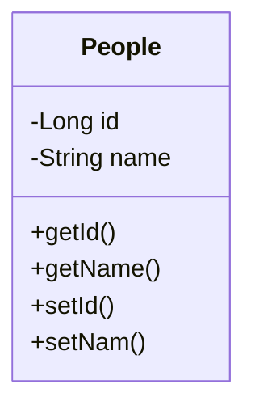

# Java Persistence Annotation

Java Persistence Annotation, or JPA, is a Java Framework that facilitates the connection between Java and relational databases. With some annotations in model file and configurations in "persistence.xml" we can create tables, relate them, and make the data manipulation querys.

# The Project

The goal of this project is to create a table, and from console entries create, delete and find entries using Java Persistence Annotation (JPA).

## Database Schema

The following Class Diagram describe the MySQL database structure.

## How to run?

<ol>
	<li>To run this application, you need to open a MySQL connection on your localhost and create a database called "TestJPA".</li>
	<li>Clone the project to your PC using the following command: 
		  <code>git clone https://github.com/kdukoelho/TestJPA.git</code></li>
	<li>Now, just run the Main.java, located in src/main/java/Main.java."</li>
</ol>
